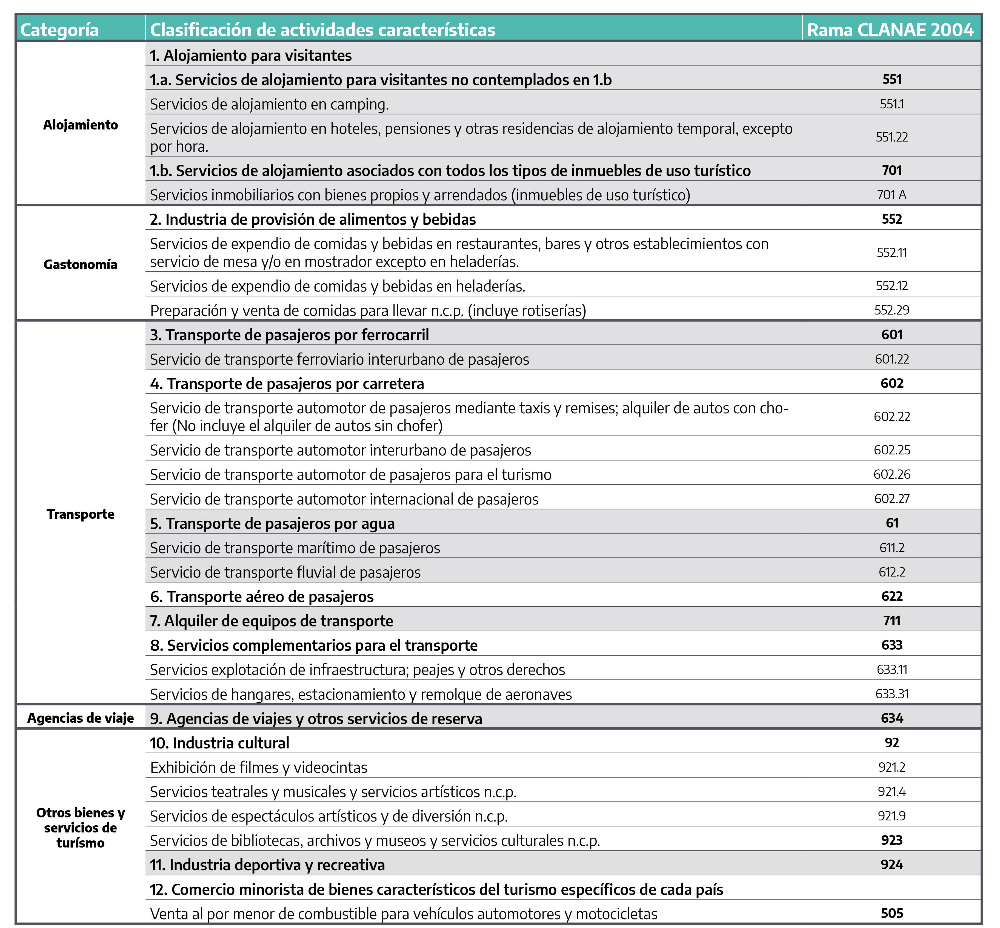

```{r libraries, include=FALSE}
knitr::opts_chunk$set(echo = FALSE, message = F)
library(tidyverse)
library(comunicacion)
```

```{=html}
<style>
  p {
  font-size: 1rem !important;
  }
</style>
```
## Turismo Interno

La sección de turismo interno utiliza la base de datos de la [Encuesta de Viajes y Turismo de los Hogares (EVyTH)](https://datos.yvera.gob.ar/dataset/encuesta-de-viajes-y-turismo-de-los-hogares-evyth-microdatos) con los registros a nivel mensual a fin de poder deflactar mensualmente el gasto con el índice de precios del consumidor de nivel general nacional. Todos los valores de gasto están expresados en pesos constantes al mes de diciembre del último año publicado.

Se publican indicadores para los años 2017 hasta el último año completo disponible. No se publican aquí estimaciones para periodos menores a un año, esto es porque con el objetivo de mejorar la estimación a nivel provincial resulta necesario acumular casos muestrales de todo un año. Para todas las estimaciones se utilizó el [paquete `survey`](http://r-survey.r-forge.r-project.org/survey/), generando un diseño de encuesta calculado para cada año que busca respetar el diseño de la metodología de la EVyTH.

```{r, eval=FALSE, echo=TRUE}
 svydesign(ids = ~id_hogar, 
            strata = ~i16_region,
            weights  = ~ pondera,
            data = x, nest = T)
```

En base al diseño creado luego se calcularon los valores totales, medias y proporciones según el caso junto a sus coeficientes de variación utilizando las funciones del paquete survey. A modo de ejemplo:

```{r,  eval=FALSE, echo=TRUE}
estimar_totales <- function(disenio, formulas) {
  svytotal(x = formulas, design = disenio) %>% 
    cbind(., cv(.)) %>%
    as_tibble(rownames = "indicadores") %>%
    rename(valor = 2, cv = V2) 
}


estimar_promedios <- function(disenio, formulas) {
  svymean(x = formulas, design = subset(disenio, tipo_visitante==1)) %>% 
    cbind(., cv(.)) %>%
    as_tibble(rownames = "indicadores") %>%
    rename(valor = 2, cv = V2) 
}

estimar_totales_prov <- function(disenio, formulas) {
  svyby(formula = formulas, by = ~provincia_destino,
        design = disenio, FUN = svytotal,
        vartype = c("cv")) %>%
    as_tibble()
}


estimar_promedios_prov <- function(disenio, formulas) {
  svyby(formula = formulas, by = ~provincia_destino,
        design = subset(disenio,  tipo_visitante==1), FUN = svymean,
        vartype = c("cv")) %>%
    as_tibble()
}


calcular_prop <- function(variable, disenio, f = NULL) {
  var_name <- variable
  
  if (is.null(f)) {
    formula_perfil <- formula(paste("~", var_name))
  } else {
    formula_perfil <- formula(paste("~", f))
  }
  
  
  svymean(x = formula_perfil,
          design = subset(disenio,
                          tipo_visitante==1 & !is.na(get(variable)))) %>% 
    cbind(., cv(.)) %>% 
    as_tibble(rownames = "indicadores") %>% 
    rename(valor = ".", cv = V2) %>% 
    mutate(indicadores = str_remove_all(pattern = var_name,
                                             indicadores))
}


calcular_prop_by <- function(variable, disenio, agrupamiento, f = NULL) {
  
  var_name <- variable
  
  if (is.null(f)) {
    formula_perfil <- formula(paste("~", var_name))
  } else {
    formula_perfil <- formula(paste("~", f))
  }
  
  formula_by <- formula(paste("~", agrupamiento))
  
  svyby(formula = formula_perfil, by = formula_by,
        design = subset(disenio,
                        tipo_visitante==1 & !is.na(get(variable))),
        FUN = svymean,
        vartype = c("cv")) %>%
    as_tibble() %>% 
    rename_with(.cols = -1, .fn = ~ str_remove_all(.x, pattern = var_name))
}

```

Esta estrategia permite reducir los coeficientes de variación para la estimaciones pero se debe tener en cuenta que incluso así las estimaciones para algunas provincias presentan coeficientes de variación grandes (mayores al 25%). El coeficiente de variación brinda una idea de la precisión relativa de la estimación, o sea la relación entre el error muestral y el valor a estimar. Cuanto más pequeño es el coeficiente de variación, más precisa es la estimación. Si bien corresponde al usuario determinar si una estimación con cierto coeficiente de variación le es útil o no para su objetivo, de acuerdo con el grado de precisión requerido, se advierte que estimaciones con coeficiente de variación superiores al 20% deben ser tratadas con precaución.

Estos mismos cálculos se pueden replicar para la [base de microdatos de evyth publicada en datos abiertos](https://datos.yvera.gob.ar/dataset/encuesta-de-viajes-y-turismo-de-los-hogares-evyth-microdatos) con la atención a que para periodos de inflación elevada el ajuste de pesos corrientes a pesos constantes puede dar un resultado levemente diferente entre la estimación mensual y la trimestral.

**Conceptos clave:**

-   **`Viaje Turístico:`** todo desplazamiento desde que sale hasta que vuelve a su lugar de residencia con una duración inferior a un año que tiene como destino un lugar ubicado fuera del entorno habitua del hogar. Se excluyen los viajes que tienen como principal motivo el ser empleado por una unidad residente del destino visitado o cuando el traslado forma parte del trabajo. Para los viajes a segundas viviendas del hogar no rige el criterio de entorno habitual y se los considera que siempre son un viaje turístico (por definición). La EVyTH considera como destinos por fuera del entorno habitual aquellos distante a más de 40 Km (para CABA y Partidos del GBA) / 20km (para resto de los aglomerados) del lugar de residencia permanente del hogar, siempre y cuando ese lugar no sea visitado con una frecuencia semanal.

-   **`Visitante:`** Toda persona que realiza un viaje turístico, pase o no una noche en el lugar visitado. Los visitantes se contabilizan en el mes en que finaliza el viaje.

-   **`Turista:`** todo visitante que pernocta al menos una noche durante su viaje turístico. Excursionista (o visitante del día): es aquel visitante que no pernocta durante su viaje turístico.

-   **`Excursionista`** (o visitante del día): es aquel visitante que no pernocta durante su viaje turístico. - Pernoctaciones: es el número de noches que cada turista permanece fuera de su lugar de residencia habitual.

-   **`Gasto Total:`** en este portal el gasto total se ha estimado sólo para los turistas, ya que en base a los informes de EVyTH son el tipo de visitante que explica más del 80% del gasto turístico agregado. Comprende todo gasto de consumo de bienes y servicios efectuado por turista o excursionista) o por cuenta de un visitante (ya que incluye una estimación del gasto financiado por Cuartos) durante su viaje turístico. Este indicador se haya expresado en pesos constantes a diciembre de 2021.

## Turismo Receptivo

La sección de turismo receptivo muestra las estadísticas derivadas de los **registros de la Dirección Nacional de Migraciones (DNM) del Ministerio de Interior de la Nación**. A partir de dichos registros se contabilizan la cantidad de tránsitos de visitantes no residentes que visitaron el país. Los conteos se realizan en el momento de la salida definitiva del país por cada paso internacional.

Pueden consultar los datos a mayor nivel de desagregación y más referencias metodológicas en el [tablero de Turismo Internacional](https://tableros.yvera.tur.ar/turismo_internacional/).

## Padrón de Alojamientos

El [**Padrón Único Nacional de Alojamiento (PUNA)**](https://datos.yvera.gob.ar/dataset/padron-unico-nacional-alojamiento) reúne todos los establecimientos de alojamiento turístico de la Argentina, en el que se detallan las principales variables de cada uno, nutrido a partir de diferentes fuentes de información. Estas fuentes de información son: los organismos provinciales y municipales de turismo que a través de su área de fiscalización de servicios turísticos elabora el padrón de alojamiento de su provincia o localidad; el INDEC a través de la Encuesta de Ocupación Hotelera y fuentes secundarias especializadas en turismo relevadas desde la DNMYE - MINTURDEP.

Del total de variables que contiene el PUNA en este tablero se utilizaron las siguientes:

-   **`Provincia:`** provincia donde se encuentra el establecimiento.

-   **`Localidad:`** ubicación geográfica del establecimiento dentro de la provincia, según la localidad en la que está ubicado.

-   **`Tipo:`** se refiere al tipo al que pertenece la categoría del establecimiento.

El MINTURDEP tiene cuatro tipos: hoteleros, parahoteleros, otros colectivos y privados.

-   **`Establecimientos:`** se refiere a la cantidad de establecimientos que conforman los distintos alojamientos turísticos.

-   **`Plazas:`** se refiere a la cantidad de plazas que tienen los establecimientos. Una plaza equivale al espacio que ocupa una persona: por ejemplo, una cama matrimonial cuenta como dos plazas.

Pueden consultar los datos a mayor nivel de desagregación en el [tablero del PUNA](https://tableros.yvera.tur.ar/puna/).

## Áreas Naturales

Los datos de áreas naturales provienen de los registros de visitas a los Parques Nacionales a través del Registro Nacional de Autorizaciones, Recaudaciones e Infracciones (RENARI) de la Administración de Parques Nacionales, quien recopila y procesa los datos de visitantes La información suministrada permite la clasificación de las visitas en residentes argentinos y no residentes en 36 Parques Nacionales de la Argentina.

Por las características del registro se considera como una visita la entrada a un parque nacional con cualquier finalidad principal (ocio, negocios u otro motivo personal) que no sea ser empleado por el parque nacional (cada vez que se cruza la frontera del área protegida, se genera una visita).

## Conectividad Aérea

El tablero presenta datos del **Sistema Integrado de Aviación Civil (SIAC)** provistos por la ANAC. El SIAC registra movimientos aéreos en el país y los datos recabados permiten conocer `cantidad de pasajeros` a bordo de cada vuelo, `origen` y `destino`, `empresa operadora del vuelo`, `cantidad de asientos` y `fecha del vuelo`. A partir de estos datos la DNMyE selecciona aquellos vuelos que corresponden a las empresas de operaciones regulares en el país, tanto para vuelos de cabotaje como en el caso de vuelos internacionales. La estadística de cantidad de pasajeros por localidad representa tránsitos de pasajeros en aterrizajes o despegues realizados en aeropuertos de dicha localidad.

Pueden consultar los datos a mayor nivel de desagregación y más detalles metodológicos en el [tablero de Conectividad](https://tableros.yvera.tur.ar/conectividad/).

## Empresas Turísticas

Estadísticas de empresas de las Ramas Características del Turismo (RCT) a partir de **datos de la Administración Federal de Ingresos Públicos (AFIP)** al mes de junio de 2021. Las ramas características del turismo se eligieron siguiendo el [Informe de cadena de valor del turismo](https://tableros.yvera.tur.ar/recursos/biblioteca/cadena_de_valor.pdf):



Las otras variables expresadas en esta sección son:

-   **`Cantidad de empresas:`** se corresponde al conteo de CUIT no repetidos.

-   **`Tamaño de la empresa:`** está definido según la cantidad de empleados declarados:

    -   **`Micro`**: de 1 a 9 empleados.

    -   **`Pequeña`**: de 10 a 49 empleados.

    -   **`Mediana`**: de 50 a 199.

    -   **`Grande`**: 200 empleados y más.

Se han omitido los datos correspondientes a departamentos donde se registraran menos de 3 empresas.
